

  

<h1 align="center">
  Simple QR Code Maker
</h1>

  Create, customize, export, and read QR codes on Windows.

  

## Overview

Simple QR Code Maker v2 is a Windows desktop app for both sides of the workflow: creating polished QR codes and reading them back from real-world images. You can make a single code or a large batch, build content from plain text or helpers like URL, Wi-Fi, email, and vCard builders, import rows from spreadsheets, style codes with frames, colors, brands, and center logos, then export everything as PNG, SVG, ZIP, or print-ready layouts.

On the reading side, v2 can decode codes from files, folders, drag-and-drop, the clipboard, camera captures, screenshots, and Windows Share targets. It also adds stronger recovery tools for difficult images, plus history, summaries, and batch export options that make it practical for day-to-day work.

## v2 Screenshots

### Create QR codes

| Start fast | Style codes | Batch with frames |
|---|---|---|
| 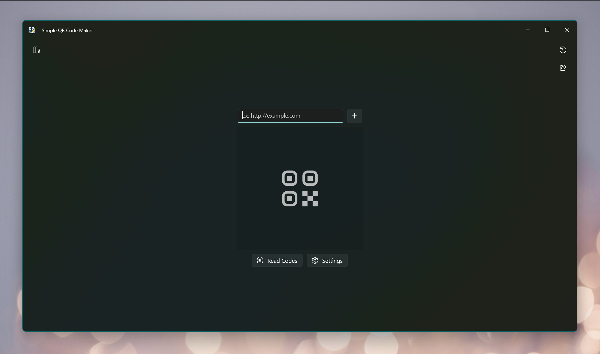 | 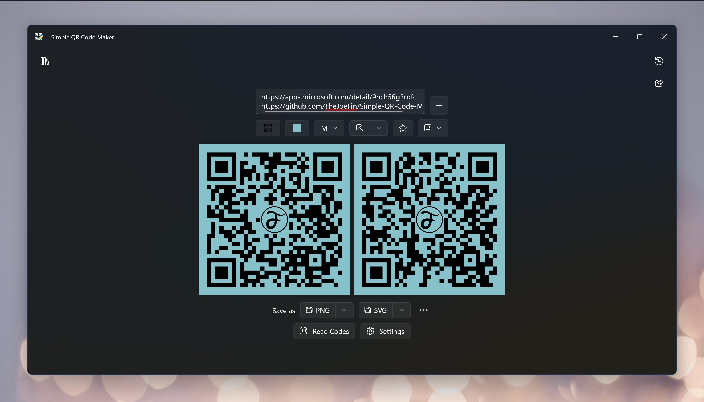 | 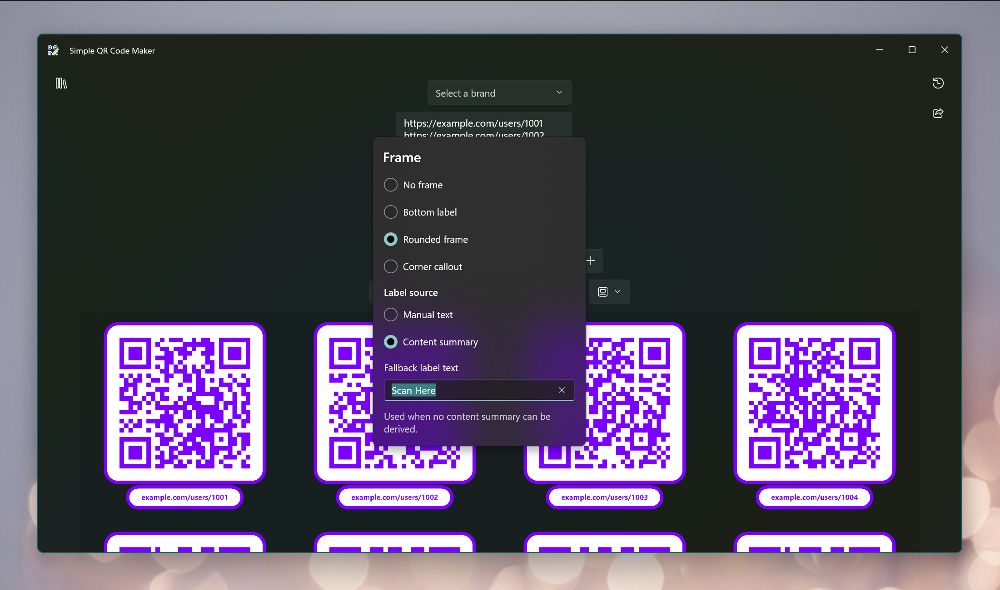 |

### Brand and logo tools

| Center logo options | Save reusable brands |
|---|---|
| 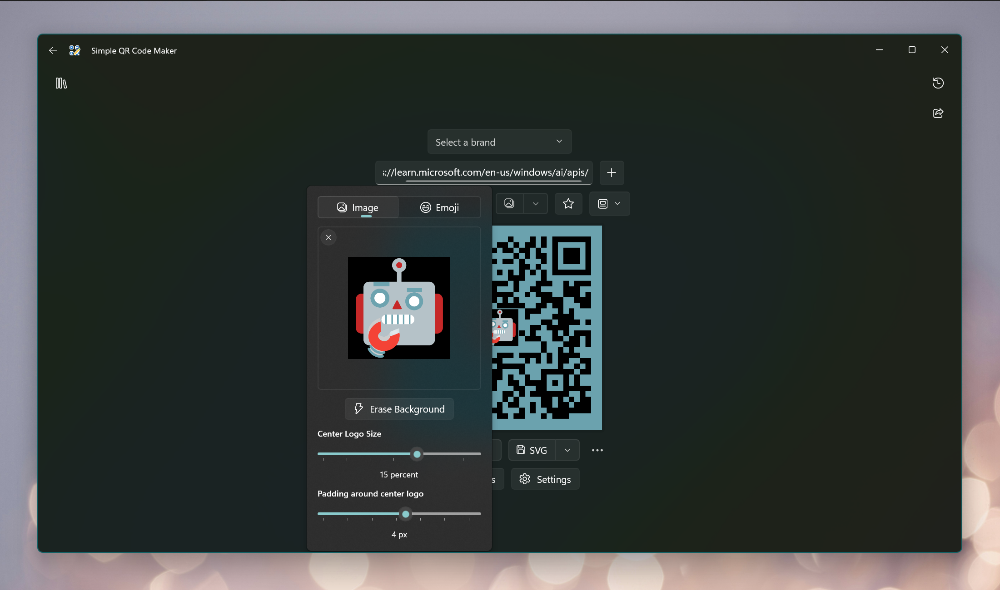 | 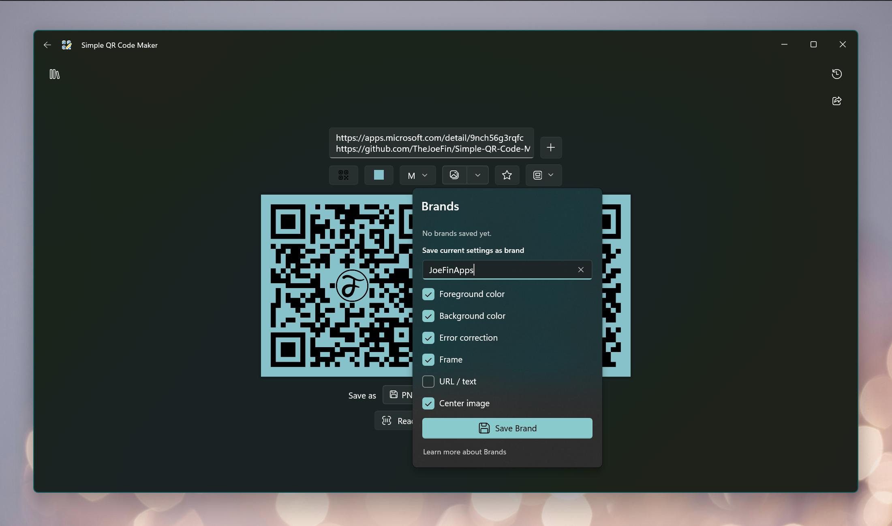 |

| Pick colors from an image | Remove logo background |
|---|---|
| 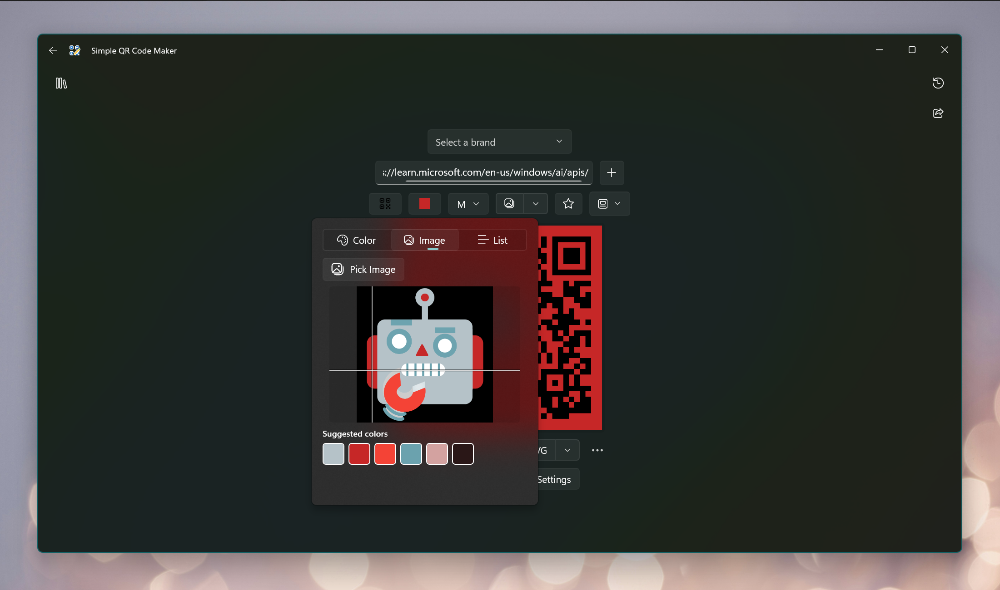 | 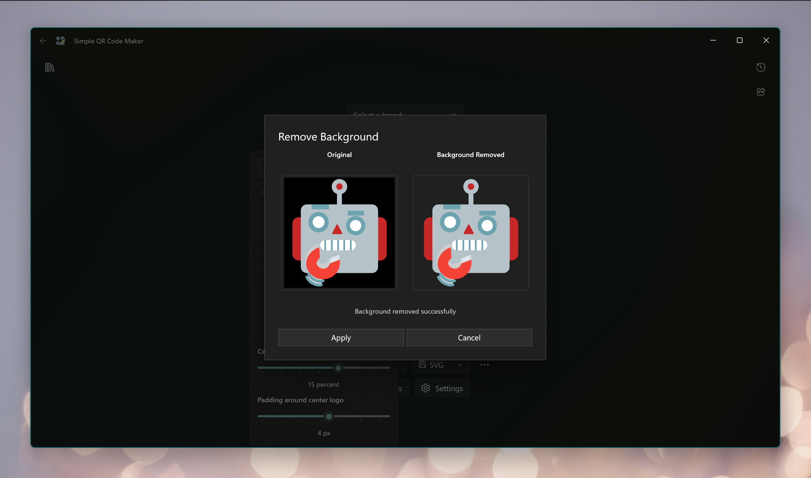 |

### Read and recover codes

| Reader home | Decode results | Folder and advanced tools |
|---|---|---|
| 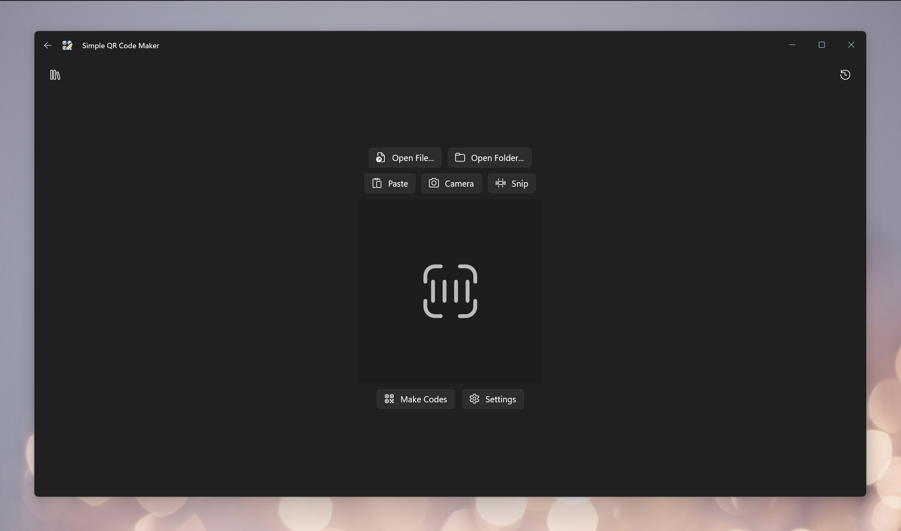 | 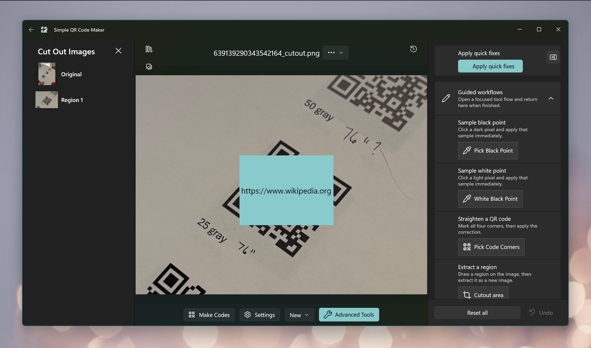 | 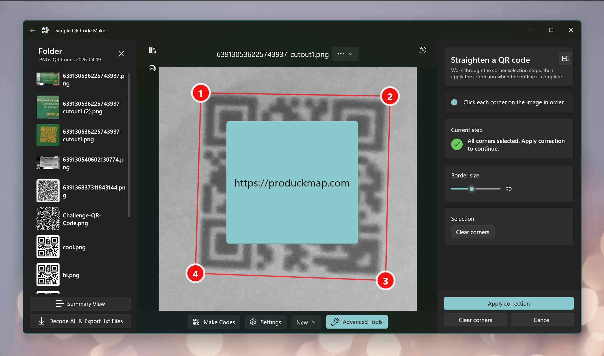 |

### Import and history

| Spreadsheet import | History |
|---|---|
| 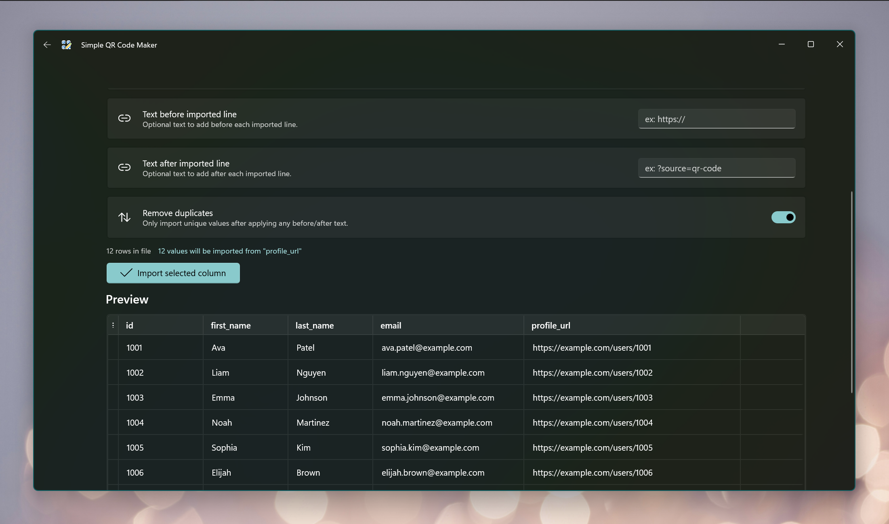 | 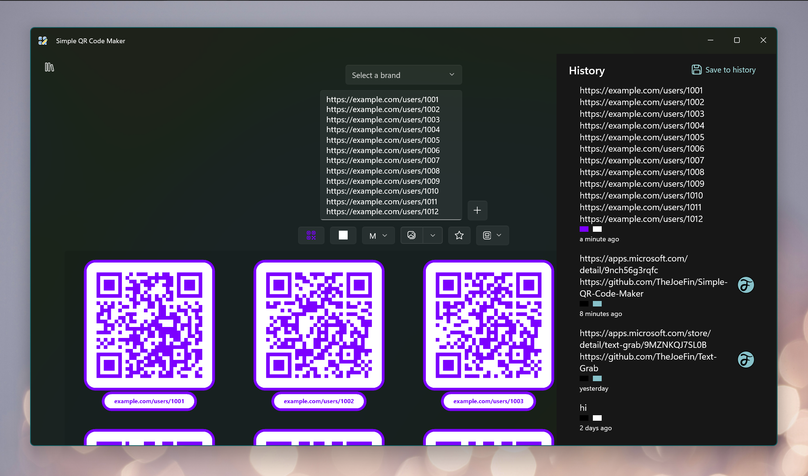 |

## Features

### Create and batch QR codes

- Generate one QR code or many QR codes at once from multiline text.
- Build QR codes for plain text, URLs, Wi-Fi credentials, email messages, and vCards.
- Load source text from `.txt` and `.csv` files.
- Import rows from `.csv` and `.tsv`, plus `.xlsx` and `.xls` when workbook support is available.
- Preview spreadsheet rows before import, choose the exact column to use, and add text before or after every imported value.
- Remove duplicate values during spreadsheet import.
- Optionally generate IDs during spreadsheet import and write them back to the source sheet.
- Switch between one-line-per-code and multi-line-as-one-code behavior.
- Preview large batches without forcing the entire batch into the clipboard workflow.

### Customize the look

- Set foreground and background colors.
- Sample colors from a logo or reference image.
- Save foreground, background, error correction, and frame settings as defaults.
- Choose QR error correction levels L, M, Q, and H.
- Add frame presets and custom label text.
- Use fallback frame text derived from content summaries where supported.
- Add center logos from image files.
- Add center logos from emoji, including style options.
- Adjust center logo size and padding.
- Remove the background from raster logos on supported devices.
- Save reusable brand presets with colors, content, error correction, logo, and frame settings.
- Apply, edit, delete, and set a default brand.

### Save, copy, print, and share

- Save QR codes as PNG.
- Save QR codes as SVG.
- Save both PNG and SVG together.
- Export batches as ZIP packages.
- Copy PNG QR codes to the clipboard.
- Copy SVG QR codes to the clipboard.
- Copy raw SVG text to the clipboard.
- Open the folder where files were saved.
- Print QR codes with configurable page type, layout, margins, spacing, code size, and labels.
- Accept shared text and URLs into the creator from the Windows Share UI.

### Read and decode QR codes

- Decode from image files.
- Decode from drag-and-drop.
- Decode from the clipboard.
- Decode from the camera.
- Decode from screenshots captured with Snipping Tool.
- Accept shared images from the Windows Share UI.
- Open a folder of images and browse every file in the app.
- Batch decode an entire folder and export a `.txt` result for each image.
- Build a folder summary view and export the summary as CSV.
- Reopen decoded source files and their containing folders.
- Save the currently decoded image.
- Copy decoded text to the clipboard.
- Launch decoded links directly.
- Send decoded content back into the QR creator to edit and regenerate.

### Advanced decoding and recovery

- Apply grayscale conversion.
- Invert colors.
- Adjust contrast.
- Sample a black point from the image.
- Sample a white point from the image.
- Add border padding to help detection.
- Select and decode a cut-out region.
- Save cut-out images.
- Correct perspective by selecting the four QR corners.
- Manually unwarp difficult QR codes with corner and alignment points.
- Re-run decoding after applying advanced image processing.

### History, safety, and settings

- Keep a history of created QR codes.
- Keep a history of decoded images and reopen past entries.
- Warn on likely redirector links.
- Mark redirector domains as safe and manage the safe-domain list.
- Choose whether the app starts in Create mode or Read mode.
- Choose the app theme.
- Set a quick-save location.
- Export settings, brands, and history to a ZIP backup.
- Import settings, brands, and history from a ZIP backup.
